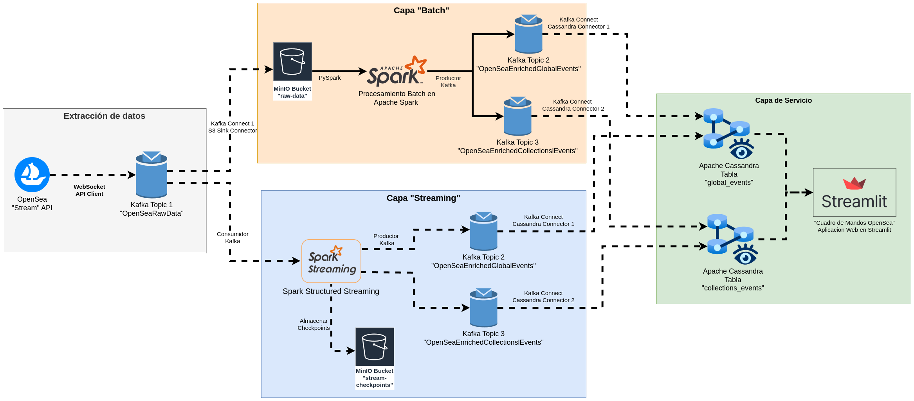

# opensea-data-streaming

A scalable Python app that analyses NFT data from OpenSea in real time using open source technologies using a Lambda streaming architecture.

See: [OpenSea Stream API Overview](https://docs.opensea.io/reference/stream-api-overview)

## Architecture

The application uses a Lambda architecture to process the data from the OpenSea API in real time. The data is retrieved from the OpenSea API using the WebSocket API and processed using Apache Spark in batch and stream mode.



## Metrics

These are the metrics that are calculated by the application for the data retrieved from the OpenSea API.

### Global Metrics

These are metrics that are calculated for the entire dataset of events retrieved from the OpenSea API in a given time window.

- Total number of transfers
- Total number of transferred items
- Total number of sales
- Total volume of sales in USD and ETH
- Top collections by volume of sales

### Collection Metrics

These are metrics that are calculated for each collection of items retrieved from the OpenSea API in a given time window.

- Total number of transfers
- Total number of transferred items
- Total number of sales
- Total volume of sales in USD and ETH
- Number of assets sold
- Floor price of the collection (lowest price of an asset sold)
- Average price of the assets sold
- Top assets by volume of sales

## Setup

You must copy the file `.env.example` to `.env` and set the environment variables to the desired values.

These variables are used to configure the application and the services that it uses.

### Environment Variables

| Variable | Description | Default Value |
|----------|-------------|---------------|
| OPENSEA_API_KEY | API key for the OpenSea API | - |
| OPENSEA_MONITORING_LOG_LEVEL | Log level for the application | INFO |
| OPENSEA_MONITORING_SPARK_LOG_LEVEL | Log level for the Spark application | WARN |
| OPENSEA_DATA_STREAM_ENV | Environment to use for collecting data from the OpenSea API. If set to `production`, the application will use the OpenSea mainnet API, otherwise it will use the testnet API. | `development` |

### Docker Compose

#### Prerequisites

- [Docker Engine](https://docs.docker.com/engine/install/)

#### Instructions

Run the following command to start all the services:

```bash
docker compose --profile all up -d
```

You can choose the services to use in the deployment using the `--profile` option.

Here is a list of all the available services and their profiles:

| Service Name | Description | Local Access | Profiles |
|--------------|-------------|--------------| ------- |
| notebook | [Jupyter Notebook](https://jupyter.org/) server with Spark integration | <http://localhost:8888> | development |
| spark | [Apache Spark](https://spark.apache.org/) master node | <http://localhost:8080> | spark |
| spark-worker | Apache Spark worker nodes. 2 replicas are started by default | | spark |
| [minio](https://min.io/) | An object storage server compatible with Amazon S3 | <http://localhost:9000> | s3 |
| [cassandra](https://cassandra.apache.org/) | Distributed NoSQL database | <http://localhost:9042> | cassandra, web |
| [zookeeper](https://zookeeper.apache.org/) | Centralized service for maintaining configuration information | | kafka |
| kafka | Distributed streaming platform | | kafka |
| conduktor | Web console for managing Kafka clusters and topics | <http://localhost:8090> | kafka |
| webapp | [Streamlit](https://streamlit.io/) web application for visualizing the data | <http://localhost:8501> | web |

> The local access for spark is the web UI for monitoring the cluster.
> For minio, the local access is the web UI for managing the object storage.

For example, if you just want to start Kafka and Cassandra, you can run:

```bash
docker compose --profile kafka --profile cassandra up -d
```

All the services are configured to use the same network. This allows them to communicate with each other using their service names.
For example, the notebook server can access the Spark master node using the URL `spark:7077`.

Spark is configured to use the MinIO server as object storage. This allows the Spark jobs to read and write data to it using an URI like `s3a://<bucket>/<path>`. This is preffered over using the local filesystem as it allows the data to be persisted even if the Spark cluster is restarted.

To stop the services run:

```bash
docker compose --profile all down
```

> Use the `down -v` option to delete all the data of the application as well.

## Usage

The services are designed to start collecting data from the OpenSea API in real time as soon as they are started.

To start processing the data in batch or stream mode you can use the Python script in the `opensea_monitoring.cli` package.

### Commands

When using the Docker Compose setup, you can execute the following commands from the `spark` service to start processing the data from the OpenSea API.

Depending on the execution mode, you can process the data in batch or stream mode. In general, the script will read the raw events gotten from the OpenSea WebSocket and write the aggregated data to the enriched events Kafka topic, which will use Kafka Connect to write the data to the Cassandra database.

#### Get help

Use the following command to see all the available options of the script:

```bash
docker compose --profile spark exec -it spark python -m opensea_monitoring.cli --help
```

#### Process global events in Batch mode

This command will process the global events in batch mode. It will read the raw events retrieved from the OpenSea API in an S3 bucket and write the enriched events to the Kafka topic `OpenSeaEnrichedGlobalEvents`. The data will be aggregated in 1 hour windows.

```sh
docker compose --profile spark --profile kafka \
    exec -e OPENSEA_MONITORING_SPARK_MASTER=spark://spark:7077 -it spark \
    python -m opensea_monitoring.cli global '1 hour' \
    --raw-events-s3-uri s3a://raw-data/topics/OpenSeaRawEvents \
    --raw-events-kafka-topic OpenSeaRawEvents \
    --kafka-brokers kafka:19092 \
    --kafka-topic OpenSeaEnrichedGlobalEvents \
    -l INFO
```

#### Process collection events in Batch mode

```bash
docker compose --profile kafka exec -e OPENSEA_MONITORING_SPARK_MASTER=spark://spark:7077 -it spark \
    python -m opensea_monitoring.cli collections '1 hour' \
    --raw-events-s3-uri s3a://raw-data/topics/OpenSeaRawEvents \
    --raw-events-kafka-topic OpenSeaRawEvents \
    --kafka-brokers kafka:19092 \
    --kafka-topic OpenSeaEnrichedCollectionsEvents \
    -l INFO
```

When processing events in Batch mode, you can also filter the events by a timestamp range. eg:

```bash
docker compose --profile kafka exec -e OPENSEA_MONITORING_SPARK_MASTER=spark://spark:7077 -it spark \
    python -m opensea_monitoring.cli global '1 hour' \
    --raw-events-s3-uri s3a://raw-data/topics/OpenSeaRawEvents \
    --raw-events-kafka-topic OpenSeaRawEvents \
    --kafka-brokers kafka:19092 \
    --kafka-topic OpenSeaEnrichedGlobalEvents \
    --timestamp-start '2024-07-28' \
    --timestamp-end '2024-07-28T12:00:00' \
    -l INFO
```

#### Process global events in Stream mode

This command will process the global events in stream mode. It will read a continuous stream of the raw events retrieved from the OpenSea API from the "Raw Events" Kafka Topic and write the enriched events to the Kafka topic `OpenSeaEnrichedGlobalEvents`. The data will be aggregated in 1 minute windows.

```bash
docker compose --profile kafka exec -it \
    -e OPENSEA_MONITORING_SPARK_MASTER=spark://spark:7077 \
    -e OPENSEA_MONITORING_LOG_LEVEL=INFO \
    -e OPENSEA_MONITORING_SPARK_MAX_CPU_CORES=1 \
    spark \
    python -m opensea_monitoring.cli global '1 minute' \
    --raw-events-s3-uri s3a://raw-data/topics/OpenSeaRawEvents \
    --raw-events-kafka-topic OpenSeaRawEvents \
    --kafka-brokers kafka:19092 \
    --kafka-topic OpenSeaEnrichedGlobalEvents \
    --slide-duration '1 minute' \
    --watermark-duration '3 minutes' \
    --checkpoint-dir s3a://stream-checkpoints/topics/ \
    -l INFO
```

#### Process collection events in Stream mode

```bash
docker compose --profile kafka exec -it \
    -e OPENSEA_MONITORING_SPARK_MASTER=spark://spark:7077 \
    -e OPENSEA_MONITORING_LOG_LEVEL=INFO \
    -e OPENSEA_MONITORING_SPARK_MAX_CPU_CORES=1 \
    spark \
    python -m opensea_monitoring.cli collections '1 minute' \
    --raw-events-s3-uri s3a://raw-data/topics/OpenSeaRawEvents \
    --raw-events-kafka-topic OpenSeaRawEvents \
    --kafka-brokers kafka:19092 \
    --kafka-topic OpenSeaEnrichedCollectionsEvents \
    --slide-duration '1 minute' \
    --watermark-duration '3 minutes' \
    --checkpoint-dir s3a://stream-checkpoints/topics/
```

#### Process all time global events

All time global events can be processed by setting the time window to `all time`. This is available for both global and collection events, however, it can only be used in batch mode.

For global events:

```sh
docker compose --profile spark --profile kafka \
    exec -e OPENSEA_MONITORING_SPARK_MASTER=spark://spark:7077 -it spark \
    python -m opensea_monitoring.cli global 'all time' \
    --raw-events-s3-uri s3a://raw-data/topics/OpenSeaRawEvents \
    --raw-events-kafka-topic OpenSeaRawEvents \
    --kafka-brokers kafka:19092 \
    --kafka-topic OpenSeaEnrichedGlobalEvents \
    -l INFO
```

For collection events:

```sh
docker compose --profile spark --profile kafka \
    exec -e OPENSEA_MONITORING_SPARK_MASTER=spark://spark:7077 -it spark \
    python -m opensea_monitoring.cli collections 'all time' \
    --raw-events-s3-uri s3a://raw-data/topics/OpenSeaRawEvents \
    --raw-events-kafka-topic OpenSeaRawEvents \
    --kafka-brokers kafka:19092 \
    --kafka-topic OpenSeaEnrichedCollectionsEvents \
    -l INFO
```

#### Debug mode for streams

Use the `--debug` option to enable debug mode for the stream processing. This will write the results of the stream processing to the console instead of writing them to the Kafka topic.

```bash
docker compose --profile kafka exec -it \
    -e OPENSEA_MONITORING_SPARK_MASTER=spark://spark:7077 \
    -e OPENSEA_MONITORING_LOG_LEVEL=DEBUG \
    spark \
    python -m opensea_monitoring.cli global '1 minute' \
    --raw-events-s3-uri s3a://raw-data/topics/OpenSeaRawEvents \
    --raw-events-kafka-topic OpenSeaRawEvents \
    --kafka-brokers kafka:19092 \
    --kafka-topic OpenSeaEnrichedGlobalEvents \
    --slide-duration '1 minute' \
    --checkpoint-dir s3a://stream-checkpoints/topics/
    --debug
```
